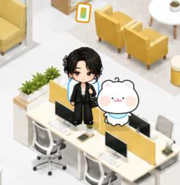
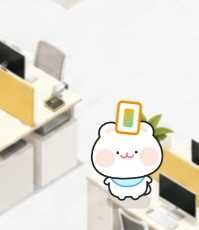

# BINI OFFICE

Readdy에서 **소복이네 캐릭터**와 **BINI 인물 캐릭터**를 하나의 오피스 공간에 배치해 구성한 웹사이트 콘셉트입니다. BINI 인물 캐릭터는 사용자를 모티브로 만든 캐릭터이며, 소복이와 함께 옐로우·화이트 중심의 아이소메트릭 오피스 안에서 캐릭터와 공간이 자연스럽게 연결되는 구성을 실험했습니다.

  

## 캐릭터와 공간 구성

- BINI 인물 캐릭터와 소복이를 같은 오피스 화면 안에 배치
- 두 캐릭터가 함께 있는 장면과 소복이 단독 장면을 별도 시각 자료로 확인
- 캐릭터가 없는 사무실 배경을 기반으로 캐릭터와 UI 요소를 더하는 구조
- 배경 이미지 입력과 소복이의 던지기·줍기 인터랙션 아이디어도 작업 과정에서 검토

  
  &nbsp;&nbsp;
  

  

## 기록 상태

화면 구성과 캐릭터·공간 조합은 사용자가 제공한 원본 작업 이미지를 기준으로 확인했습니다. 최종 배포 URL과 실제 인터랙션 구현 범위는 현재 기록에서 확인되지 않아 완료 상태로 단정하지 않습니다.
